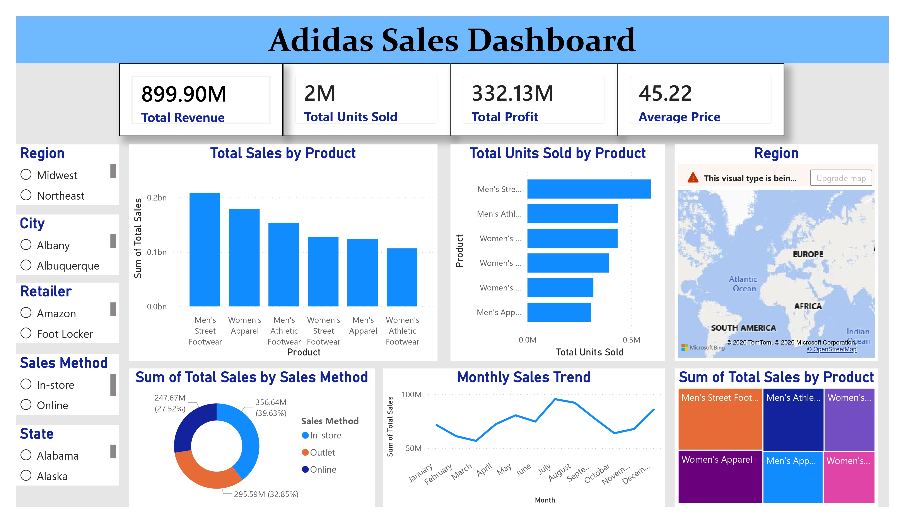

# Adidas Sales Performance Dashboard using Power BI

## 📊 Dashboard Preview

## 📌 Overview

This project presents an interactive Adidas Sales Performance Dashboard developed using Microsoft Power BI. The dashboard provides detailed insights into sales, profit, and overall business performance, enabling data-driven decision-making. It focuses on analyzing key performance indicators (KPIs), identifying trends, and evaluating business efficiency.

## ✨ Key Features

* KPI Cards: Total Sales, Total Profit, Profit Margin, Sales Growth
* Trend Analysis: Monthly sales performance
* Regional Insights: Sales distribution by region
* Product Analysis: Sales and units sold by product
* Interactive Filters: Region, City, Retailer, Sales Method, State
* Performance Analysis: Growth, profitability, and contribution insights

## 🛠️ Technologies Used

* Microsoft Power BI Desktop – Dashboard development
* Microsoft Excel – Data source
* DAX (Data Analysis Expressions) – Calculated measures
* Power Query – Data transformation and cleaning

## 🚀 Getting Started

Prerequisites:

* Microsoft Power BI Desktop
* Microsoft Excel

Installation & Usage:

1. Clone the repository
   git clone https://github.com/Janiith07/adidas-sales-performance-analysis.git

2. Open the Power BI file
   Navigate to the powerbi/ folder and open Performance Analysis.pbix

3. Update Data Source (if needed)
   Go to Home → Transform Data → Data Source Settings
   Update the path to your Excel file

4. Refresh Data
   Click Refresh

5. Explore Dashboard
   Use slicers and filters to interact with the data

## 📊 Key Metrics

* Total Sales
* Total Profit
* Sales Growth (%)
* Profit Margin (%)
* Total Units Sold

## 📈 Dashboard Insights

This dashboard helps identify top-performing products and regions, analyze sales trends over time, evaluate profitability, and understand key business performance drivers.

## 🎯 Use Cases

* Business Performance Analysis
* Retail Sales Insights
* Data Analytics Portfolio Projects
* Decision Support Systems

## 🧠 Skills Demonstrated

* Data Visualization
* Business Intelligence
* DAX Calculations
* Dashboard Design
* Data Analysis & Storytelling

